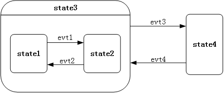

## Features

Just a simple implemention of HSM(Hierarchical State Machine) framework for game.

1. C++11 implemention support Hierarchical FSM with simple user interface.
2. All event definition (though inside class) have an identical ID
3. Event response priority: outer hierarchical is higher

## Example

Just inherit from `class HSM_Region` to define an FSM. Initialization of `states` carefully. Below is an HSM example.



```cpp
#include <Windows.h>   // Just for Sleep()
#include "StateMachine.h"

class HelloHSM : public HSM_Region {
public:

	HelloHSM(const std::string& name = "Unknow", HSM_Region* parent = nullptr) 
		: HSM_Region(name, parent), state1("state1",this), state2("state2", this) {  // Specific the state initialization
		state1.addTransitionTuple(&evt1, &state2, [] {std::cout << "==>HelloHSM: Hello state2" << std::endl; return true; });
		state2.addTransitionTuple(&evt2, &state1, [] {std::cout << "==>HelloHSM: Hello state1" << std::endl; return true; });

		setInitialState(&state1);  // Each Region should set an initial state
	}

	HSM_Region state1;
	HSM_Region state2;
	HSM_Event evt1;
	HSM_Event evt2;
};

class ThankHSM : public HSM_Region {
public:
	ThankHSM(const std::string& name = "Unknow", HSM_Region* parent = nullptr) 
		: HSM_Region(name, parent), state3("state3", this), state4("state4", this) {
		state3.addTransitionTuple(&evt3, &state4, [] {std::cout << "==>ThankHSM: Hello state4" << std::endl; return true; });
		state4.addTransitionTuple(&evt4, &state3, [] {std::cout << "==>ThankHSM: Hello state3" << std::endl; return true; });

		setInitialState(&state3);
	}

	HelloHSM state3;
	HSM_Region state4;

	HSM_Event evt3;
	HSM_Event evt4;
};

int main() {
	ThankHSM hello;

	int k = 0;
	while (true)
	{
		switch (k % 7) {
		case 0:
			hello.enqueueEvent(&(hello.state3.evt1), "enqueue evt1"); break;
		case 1:
			hello.enqueueEvent(&(hello.state3.evt2), "enqueue evt2"); break;
		case 2:
			hello.enqueueEvent(&(hello.evt3), "enqueue evt3"); break; 
		case 3:
			hello.enqueueEvent(&(hello.evt4), "enqueue evt4"); break;
		case 4:
			hello.enqueueEvent(&(hello.evt3), "enqueue evt3"); break;
		case 5:
			hello.enqueueEvent(&(hello.evt4), "enqueue evt4"); break;
		case 6:
			hello.enqueueEvent(&(hello.evt4), "enqueue evt4"); break;
		default:
			break;
		}
		k++;

		hello.run();
		
		Sleep(500);
	}
}
``` 

Result: 

```
enqueue evt1
==>HelloHSM: Hello state2
enqueue evt2
==>HelloHSM: Hello state1
enqueue evt3
==>ThankHSM: Hello state4
enqueue evt4
==>ThankHSM: Hello state3
enqueue evt3
==>ThankHSM: Hello state4
enqueue evt4
==>ThankHSM: Hello state3
enqueue evt4
enqueue evt1
==>HelloHSM: Hello state2
enqueue evt2
==>HelloHSM: Hello state1
enqueue evt3
```
